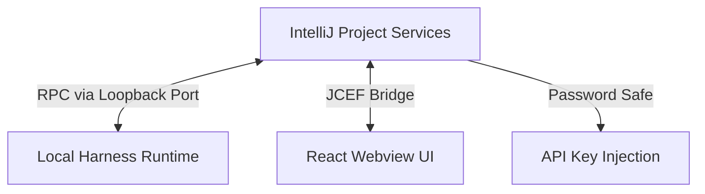

<p align="center">
  
</p>

<h1 align="center">DSH IntelliJ Integration</h1>

<p align="center">
  DSH integration for IntelliJ Platform IDEs, including IntelliJ IDEA and PyCharm.
</p>

<p align="center">
  <a href="https://plugins.jetbrains.com/plugin/33924-deepseek-harness-integration"></a>
  <a href="https://github.com/HarcoChen/dsh-intellij-integration/blob/main/LICENSE"></a>
  


</p>

<p align="center">
  <strong>English</strong> | <a href="README.zh-CN.md">简体中文</a>
</p>

<p align="center">
  <em>An independent community project. Issues welcome.</em>
</p>

<p align="center">
  For VS Code, please see <a href="https://github.com/HarcoChen/dsh-vsc-integration">dsh-vsc-integration</a>.
</p>

## Features

### Chat right in the IDE

The `DSH` tool window embeds the full chat surface via JCEF: sessions, history, tool cards, the context composer, focus mode, and runtime status.

### Editor-aware prompts

Select code and right-click: `DSH: Ask About Selection`, or explain / fix / review / document the selection from the `DSH` popup group. The selection is captured at send time inside an untrusted `<ide_context>` block, capped by the configured byte limit.

### Managed local Runtime

The plugin runs `pnpm dlx @deepseek-ai/dsh web --no-open` by default, falls back to an installed `dsh` or `npx`, and probes localhost until the server is ready. Start / stop / restart actions are available from the Tools menu, and `DSH: Open Web UI` opens the same session in a browser.

### Safe credential handling

API keys are stored in IntelliJ's Password Safe and injected only into a newly started Runtime process — never written to project XML, prompts, or logs. `DSH: Diagnose Environment` and `DSH: Open Runtime Logs` help when something goes wrong.

## Data use and privacy

The plugin does not collect telemetry. Prompts and editor selections that you explicitly attach are sent through the local DSH Runtime to the model provider configured by you. That provider's terms and privacy policy apply to the requests it processes. API keys remain in IntelliJ Password Safe and are passed only to a newly started local Runtime process.

## Support

Report bugs and request features through the [GitHub issue tracker](https://github.com/HarcoChen/dsh-intellij-integration/issues).

## Architecture and runtime

The host side is plain IntelliJ project services talking to the Harness Web RPC endpoint over loopback. The wire boundary stays typed as JSON, so new Harness projections remain forward compatible; event streams are projected through a short-interval history/catalog refresh, which keeps reconnects and older Harness versions predictable.



## Configuration

Open **Settings | Tools | DeepSeek Harness**.

| Setting | Default | What it does |
| --- | --- | --- |
| Command / Args | `pnpm dlx @deepseek-ai/dsh web --no-open` | How the Runtime is launched; point it at an installed `dsh` or a local checkout instead. |
| Server URL / Port | `""` / `0` | Connect to an already running dsh web Runtime instead of launching one. |
| Auto start | `true` | Start or connect to the Runtime when the project opens. |
| Runtime version | `0.1.1-rc.2` | Locked version of the managed Runtime. |
| npm registry | `https://registry.npmmirror.com` | Registry mirror used as a download fallback. |
| Timeouts | `30s` startup, `600s` request | How long to wait for startup and individual RPC calls. |
| Context bytes | `120000` | Maximum UTF-8 bytes of `<ide_context>` included per prompt. |
| API key env | `DEEPSEEK_API_KEY` | Environment variable the stored key is injected as. |

## Build from source

```bash
./gradlew verifyPlugin   # structure and compatibility checks
./gradlew buildPlugin    # produce the installable zip
```

## License

[MIT](LICENSE)
