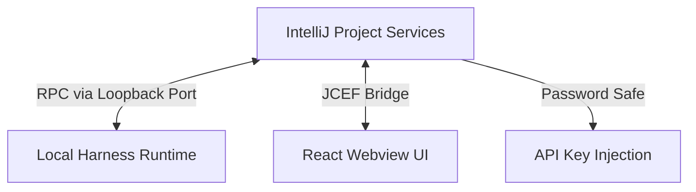

<p align="center">
  
</p>

<h1 align="center">DSH IntelliJ Integration</h1>

<p align="center">
  面向 IntelliJ IDEA、PyCharm 等 IntelliJ Platform IDE 的 DSH 集成插件
</p>

<p align="center">
  <a href="https://plugins.jetbrains.com/plugin/33924-deepseek-harness-integration"></a>
  <a href="https://github.com/HarcoChen/dsh-intellij-integration/blob/main/LICENSE"></a>
  

</p>

<p align="center">
  <a href="README.md">English</a> | <strong>简体中文</strong>
</p>

<p align="center">
  <em>独立社区项目，欢迎提 issue。</em>
</p>

<p align="center">
  VS Code 版本请见 <a href="https://github.com/HarcoChen/dsh-vsc-integration">dsh-vsc-integration</a>。
</p>

## 核心功能

### IDE 内的聊天窗口

`DSH` 工具窗口通过 JCEF 嵌入完整的聊天界面：会话、历史、工具卡片、上下文输入、Focus 模式和运行时状态一应俱全。

### 编辑器上下文

选中代码后右键：`DSH: Ask About Selection`，或在 `DSH` 菜单组里对选区执行解释 / 修复 / 审查 / 生成文档。选区内容在发送时才会被读取，放进不可信的 `<ide_context>` 块，并按配置的字节上限截断。

### 托管本地 Runtime

默认运行 `pnpm dlx @deepseek-ai/dsh web --no-open`，并支持已安装的 `dsh`、`npx` 回退和 localhost 就绪探测。Tools 菜单提供启动 / 停止 / 重启，`DSH: Open Web UI` 可以在浏览器里打开同一个会话。

### 安全的凭据管理

API Key 存放在 IntelliJ Password Safe 中，仅在新 Runtime 进程启动时注入——不会写入项目 XML、prompt 或日志。出问题时可以用 `DSH: Diagnose Environment` 和 `DSH: Open Runtime Logs` 排查。

## 数据使用与隐私

插件自身不收集遥测数据。你主动提交的 prompt 和编辑器选区会通过本地 DSH Runtime 发送给你所配置的模型服务商，相应请求受该服务商的条款和隐私政策约束。API Key 保存在 IntelliJ Password Safe 中，仅传递给新启动的本地 Runtime 进程。

## 支持与反馈

请通过 [GitHub Issues](https://github.com/HarcoChen/dsh-intellij-integration/issues) 报告问题或提交功能建议。

## 架构与运行机制

宿主侧是普通的 IntelliJ 项目服务，通过 loopback 端口与 Harness Web RPC 通信。RPC 边界保持 JSON 兼容，新的 Harness projection 不会因为 IDE 端版本较旧而出问题；事件更新采用短间隔的 history/catalog 刷新，以兼容重连和不同版本的 Harness。



## 配置

打开 **Settings | Tools | DeepSeek Harness**。

| 设置项 | 默认值 | 说明 |
| --- | --- | --- |
| 命令 / 参数 | `pnpm dlx @deepseek-ai/dsh web --no-open` | Runtime 的启动方式，也可以指向已安装的 `dsh` 或本地源码目录。 |
| 服务地址 / 端口 | `""` / `0` | 设置后直接连接已运行的 dsh web Runtime，不再本地启动。 |
| 自动启动 | `true` | 项目打开时自动启动或连接 Runtime。 |
| Runtime 版本 | `0.1.1-rc.2` | 托管 Runtime 的锁定版本。 |
| npm 镜像 | `https://registry.npmmirror.com` | 下载后备重试的 Registry 镜像。 |
| 超时 | 启动 `30s`，请求 `600s` | 等待启动和单次 RPC 调用的超时时间。 |
| 上下文字节数 | `120000` | 单次请求中 `<ide_context>` 的最大 UTF-8 字节数。 |
| API Key 环境变量 | `DEEPSEEK_API_KEY` | 凭据注入到 Runtime 进程时使用的环境变量名。 |

## 从源码构建

```bash
./gradlew format         # 应用仓库统一的 Java 格式化规则
./gradlew lint           # 检查格式并运行 Checkstyle
./gradlew verifyPlugin   # 结构与兼容性检查
./gradlew buildPlugin    # 生成可安装的 zip
```

## 许可证

[MIT](LICENSE)
